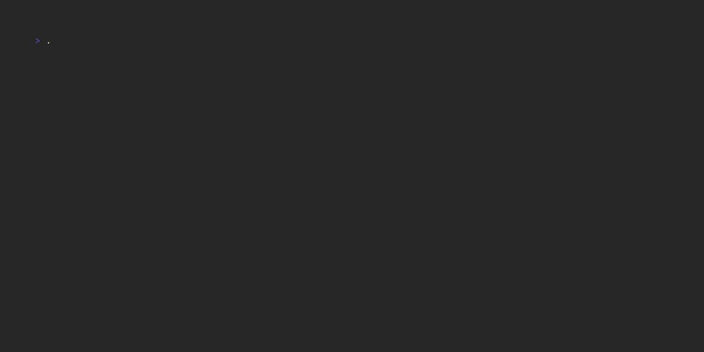

# sysc-Go

Terminal animation library for Go. Pure Go animations ready to use in your TUI applications.

## Features

- **Fire Effect** - DOOM PSX-style fire animation
- **Matrix Rain** - Classic Matrix digital rain
- **Fireworks** - Particle-based fireworks display
- **ASCII Rain** - Character-based rain effect
- **Print Effects** - Typewriter-style text rendering (library use only)

## Effect Showcase

### Fire


### Matrix


### Fireworks


### Rain


### Print *(in development)*

### Pour *(in development)*

### Decrypt *(in development)*

## Installation

```bash
go install github.com/Nomadcxx/sysc-Go/cmd/syscgo@latest
```

## Quick Start

Run any animation directly from command line:

```bash
# Fire effect with Dracula theme (default)
syscgo -effect fire

# Matrix rain with Nord theme for 30 seconds
syscgo -effect matrix -theme nord -duration 30

# Gruvbox fire effect (infinite loop)
syscgo -effect fire -theme gruvbox -duration 0
```

**Available themes:** dracula, gruvbox, nord, tokyo-night, catppuccin, material, solarized, monochrome, transishardjob

## Demo

Run the interactive demo to see all animations:

```bash
cd examples/demo
go run .
```

## Documentation

See [GUIDE.md](GUIDE.md) for detailed usage.

## License

MIT
